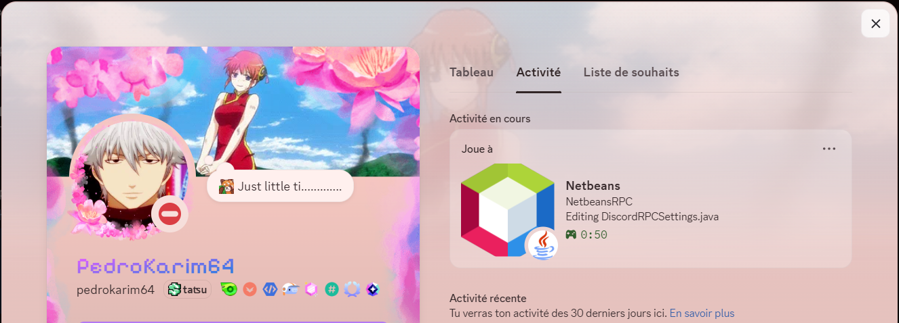
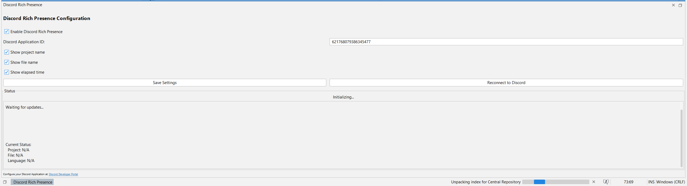
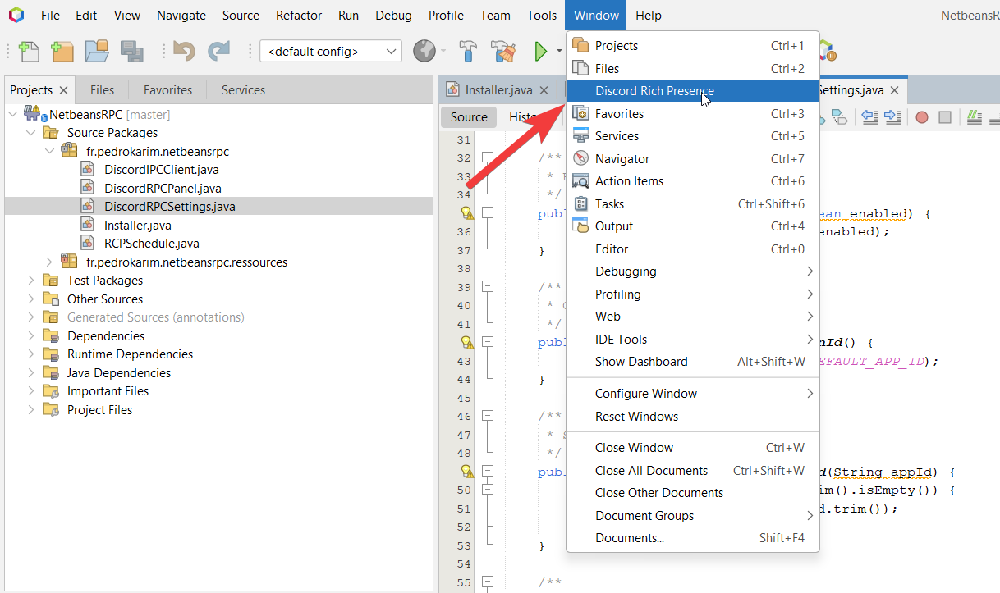

# NetbeansRPC

A NetBeans IDE plugin that integrates Discord Rich Presence to share your coding activity with your Discord friends in real-time.


## Description

NetbeansRPC is a NetBeans Platform module that uses Discord's IPC protocol to display your current coding activity directly on your Discord profile. When you're working in NetBeans IDE, your Discord status will automatically update to show:

- Current project name
- File you're editing
- Programming language/file type
- Time spent coding
- Configuration panel for customizing your presence

## Preview

<p align="center">
  
</p>

<p align="center">
  
  
</p>

## Features

- **Automatic Activity Updates**: Your Discord presence updates automatically every 12 seconds
- **Project Detection**: Displays the name of the project you're working on
- **File Tracking**: Shows which file you're currently editing
- **Language Detection**: Identifies the programming language based on file type (Java, XML, HTML, JavaScript, Python, Kotlin, Groovy, TypeScript, and more)
- **Smart Idle Detection**: Shows "Idle" status when you're not actively editing
- **Configuration Panel**: Open from Window menu to configure settings
  - Enable/disable Rich Presence
  - Configure Discord Application ID
  - Customize what information to display (project, file, timestamp)
  - View real-time status updates
- **Pure Java**: No native libraries required - communicates directly with Discord via IPC named pipes
- **Lightweight**: Minimal performance impact on your IDE
- **Modern**: Built for NetBeans 23+ (Apache NetBeans IDE 23 and later)

## Prerequisites

- **NetBeans IDE**: Version 23.0 or higher (Apache NetBeans)
- **Java**: JDK 17 or higher
- **Maven**: Version 3.x
- **Discord**: Desktop application running on your computer
- **Discord Application**: You need to create a Discord application (see Configuration section)

## Installation

### Option 1: From NBM File (Recommended)

1. Build the project:
   ```bash
   mvn clean install
   ```

2. In NetBeans, go to `Tools` > `Plugins` > `Downloaded`
3. Click `Add Plugins...`
4. Navigate to `target/nbm/` and select the generated `NetbeansRPC-<version>.nbm` file
5. Click `Install` and follow the wizard
6. Restart NetBeans IDE

### Option 2: Development Installation

1. Clone the repository:
   ```bash
   git clone https://github.com/pedrokarim/NetbeansRPC.git
   cd NetbeansRPC
   ```

2. Build and install:
   ```bash
   mvn clean install
   ```

## Building from Source

```bash
# Compile the project
mvn clean compile

# Package as NBM (NetBeans Module)
mvn clean install

# Clean build artifacts
mvn clean
```

The compiled NBM file will be available in the `target/nbm/` directory.

## Releases

Releases are published automatically by GitHub Actions when a tag starting with `v` is pushed.

```bash
git tag v2.1.0
git push origin HEAD --follow-tags
```

When the tag is received by GitHub, the workflow:

- derives the Maven version from the tag (`v2.1.0` -> `2.1.0`)
- builds the NetBeans module package (`.nbm`)
- creates a GitHub Release
- uploads the `.nbm` file and its SHA-256 checksum

## Configuration

### Using the Configuration Panel (Recommended)

1. After installation, go to `Window` > `Discord Rich Presence` in NetBeans
2. The configuration panel allows you to:
   - Enable or disable Discord RPC
   - Change the Discord Application ID
   - Toggle project name display
   - Toggle file name display
   - Toggle elapsed time display
   - View real-time status and activity
3. Click "Save Settings" to apply changes
4. Click "Reconnect to Discord" to restart the connection

### Discord Application Setup

1. Go to [Discord Developer Portal](https://discord.com/developers/applications)
2. Create a new application or use an existing one
3. Note your **Application ID** (Client ID)
4. In the "Rich Presence" > "Art Assets" section, upload assets:
   - `first` - NetBeans IDE logo (for large image)
   - `java` - Java/language icon (for small image)

## Usage

Once installed, the plugin starts automatically when NetBeans IDE launches. You'll see:

- A console message: `[PluginRPC] NetbeansRPC has loaded.`
- Your Discord status will update automatically as you work
- Open a project and start editing files to see the presence in action

The plugin will display:
- **Large Image**: NetBeans IDE logo (asset key: `first`)
- **Details**: Project name (e.g., "MyProject")
- **State**: Current file (e.g., "Editing Main.java")
- **Small Image**: Language icon with tooltip (e.g., "Programming in Java")
- **Timestamp**: Shows how long you've been working

## Project Structure

```
NetbeansRPC/
├── pom.xml                           # Maven configuration
├── src/
│   └── main/
│       ├── java/fr/pedrokarim/netbeansrpc/
│       │   ├── Installer.java        # Module installer and lifecycle
│       │   ├── RCPSchedule.java      # Presence update logic and scheduling
│       │   ├── DiscordIPCClient.java # Pure Java Discord IPC client
│       │   ├── DiscordRPCPanel.java  # Configuration UI panel
│       │   └── DiscordRPCSettings.java # Settings management
│       └── resources/fr/pedrokarim/netbeansrpc/
│           ├── Bundle.properties     # Module metadata
│           └── layer.xml             # NetBeans layer registration
├── doc/                              # Documentation
└── target/                           # Build output (generated)
```

## How It Works

1. **Module Installation**: `Installer.java` uses the `@OnShowing` annotation to start when NetBeans launches
2. **Timer Setup**: A timer schedules updates every 12 seconds
3. **Activity Detection**: `RCPSchedule.java` monitors the active editor window
4. **NetBeans API Integration**: Uses NetBeans Platform APIs to detect:
   - Current file being edited (`EditorCookie`, `DataObject`)
   - Current project (`FileOwnerQuery`, `ProjectUtils`)
   - File type and MIME type (`FileObject.getMIMEType()`)
5. **Discord Communication**: `DiscordIPCClient.java` communicates directly with Discord via IPC named pipes (`\\.\pipe\discord-ipc-X`) using the Discord IPC protocol (JSON over framed binary)
6. **Cleanup**: Properly clears presence and closes the IPC connection when NetBeans closes (via shutdown hook)

## Contributing

Contributions are welcome! Please feel free to submit pull requests or open issues for bugs and feature requests.

## License

This project is licensed under the GNU General Public License v3.0 - see the [LICENSE](LICENSE) file for details.

## Author

**Pedro Karim**
- GitHub: [@pedrokarim](https://github.com/pedrokarim)

## Additional Documentation

For more detailed information, see the [documentation folder](doc/):
- [NetBeans Plugin Development Guide](doc/netbeans-plugin-development-guide.md)
- [Project Structure Details](doc/project-structure.md)
- [Discord IPC Integration](doc/discord-rpc-integration.md)
